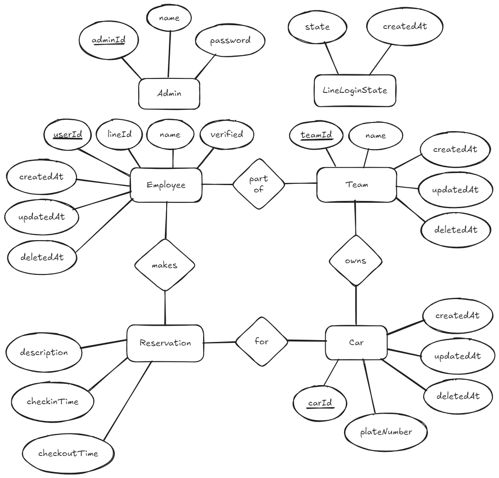

# Database Schema Description

## ER Diagram

## Data Dictionary

### Table: Employee
| Column Name | Data Type | Description | Allow Nulls |
|-------------|-----------|-------------|-------------|
| userId | INTEGER (PK) | Unique identifier for the employee. Auto-incremented. | No |
| lineId | TEXT | LINE platform ID. | Yes |
| name | TEXT | Employee's full name. | No |
| verified | INTEGER | Verification status (1 for yes, 0 for no). | No |
| teamId | INTEGER (FK) | Refers to the `teamId` in the Team table. | Yes |
| createdAt | TEXT | Timestamp for record creation. | No |
| updatedAt | TEXT | Timestamp for last update. | No |
| deletedAt | TEXT | Timestamp of deletion (for soft delete). | Yes |

### Table: Team
| Column Name | Data Type | Description | Allow Nulls |
|-------------|-----------|-------------|-------------|
| teamId | INTEGER (PK) | Unique team identifier. Auto-incremented. | No |
| name | TEXT | Name of the team. | No |
| createdAt | TEXT | Timestamp for record creation. | No |
| updatedAt | TEXT | Timestamp for last update. | No |
| deletedAt | TEXT | Timestamp of deletion (for soft delete). | Yes |

### Table: Car
| Column Name | Data Type | Description | Allow Nulls |
|-------------|-----------|-------------|-------------|
| carId | INTEGER (PK) | Unique car identifier. Auto-incremented. | No |
| plateNumber | TEXT | License plate number of the car. | No |
| teamId | INTEGER (FK) | Associated team’s ID. | Yes |
| createdAt | TEXT | Timestamp for record creation. | No |
| updatedAt | TEXT | Timestamp for last update. | No |
| deletedAt | TEXT | Timestamp of deletion (for soft delete). | Yes |

### Table: Admin
| Column Name | Data Type | Description | Allow Nulls |
|-------------|-----------|-------------|-------------|
| adminId | INTEGER (PK) | Unique administrator ID. Auto-incremented. | No |
| name | TEXT | Administrator’s name. | Yes |
| password | TEXT | Hashed password. | Yes |
| createdAt | TEXT | Timestamp for record creation. | No |
| updatedAt | TEXT | Timestamp for last update. | No |
| deletedAt | TEXT | Timestamp of deletion (for soft delete). | Yes |

### Table: Reservation
| Column Name | Data Type | Description | Allow Nulls |
|-------------|-----------|-------------|-------------|
| reservationId | INTEGER (PK) | Unique reservation ID. Auto-incremented. | No |
| userId | INTEGER (FK) | Refers to employee making the reservation. | No |
| carId | INTEGER (FK) | Refers to the reserved car. | No |
| description | TEXT | Notes or purpose of the reservation. | No |
| checkinTime | TEXT | Scheduled check-in timestamp. | No |
| checkoutTime | TEXT | Scheduled check-out timestamp. | Yes |

### Table: LineLoginState
| Column Name | Data Type | Description | Allow Nulls |
|-------------|-----------|-------------|-------------|
| state | TEXT (UNIQUE) | Session or login state identifier. | No |
| createdAt | TEXT | Timestamp for when the login state was created. | No |
